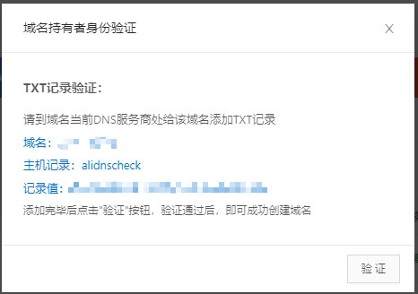
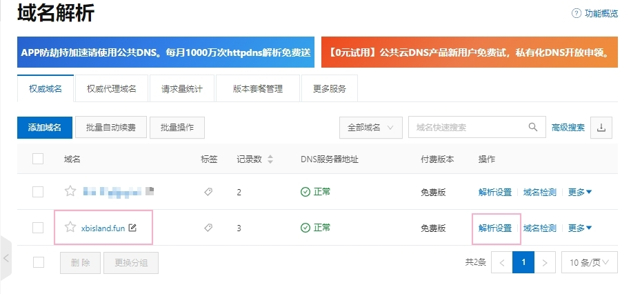
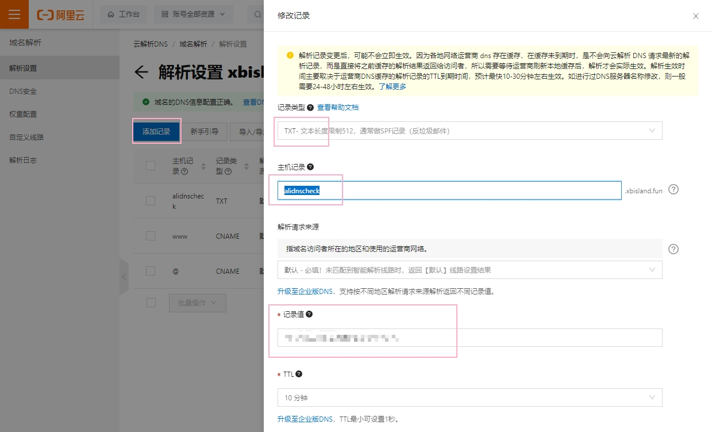
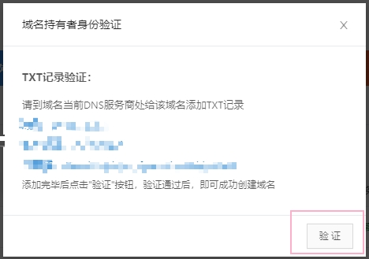
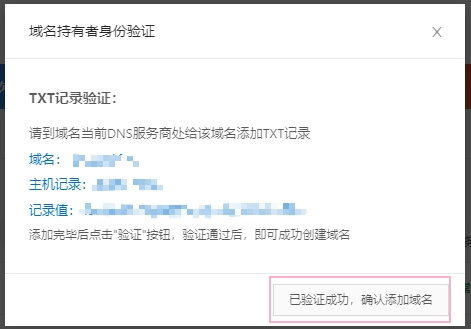
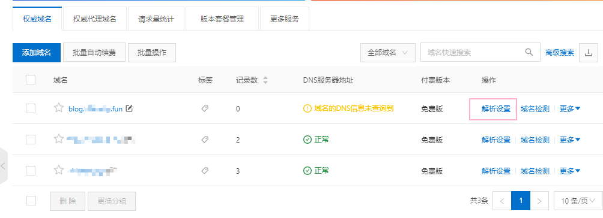
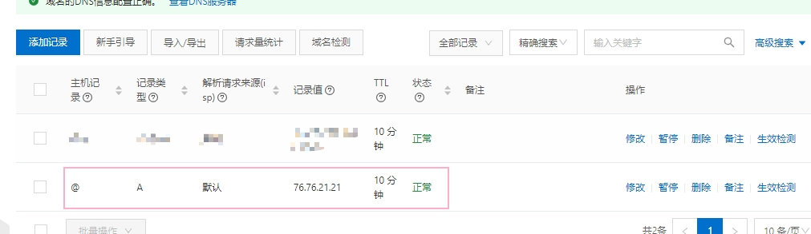
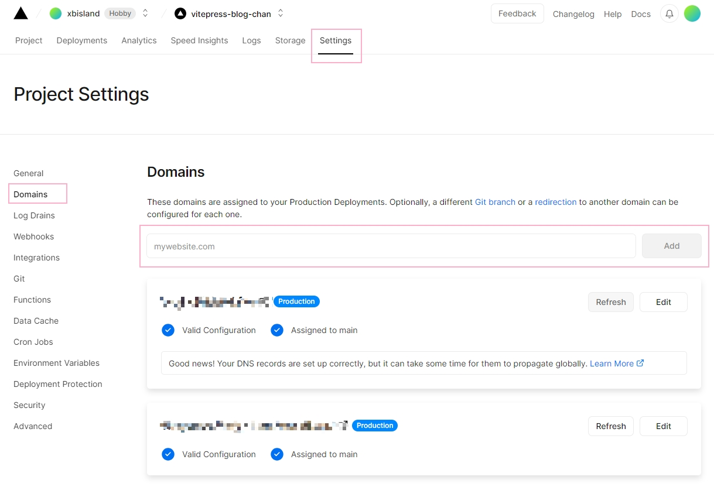

# Vercel 关联个人域名

记录如何将个人域名解析映射到 [Vercel](https://vercel.com/) 部署的项目，本文域名解析以阿里云控制台为例。

必备条件：
1. 准备一个域名
2. 已部署的 [Vercel](https://vercel.com/) 项目

## 阿里云控制台
登录阿里云[云解析控制台](https://dns.console.aliyun.com/#/dns/domainList)
### 1. 获取子域名记录值
点击添加域名，输入需要解析的子域名，此时会提示 "添加子域，请先前往进行TXT授权校验 TXT 授权校验"，点击 "TXT 授权校验" 后记下 `记录值` 。

### 2. 设置 TXT 授权
关闭所有弹窗，点击主域名的 "解析设置" 进入二级页面。

点击 "添加记录" ，"记录类型" 为 "TXT"，"主机记录" 为固定的 `alidnscheck`， "记录值" 为上一步获取的 `记录值`，点击 "确认"。

### 3. 新增子域名

设置完第二步的授权后，返回域名解析页面，来添加并校验我们的子域名，验证成功后确认添加。

### 4. 添加子域名解析记录

添加完之后能在列表看到新增的子域名，点击 "解析设置" 进入二级页面，并添加一条记录

## Vercel Domains 配置

如下图，在此将子域名填入新增即可，等待 Vercel 重写部署即可

